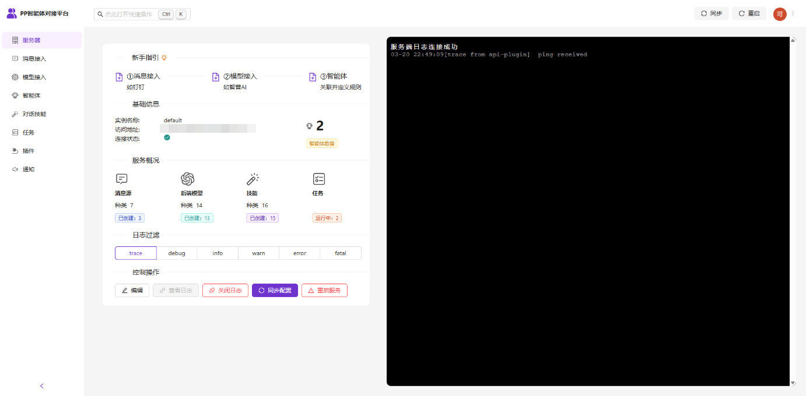
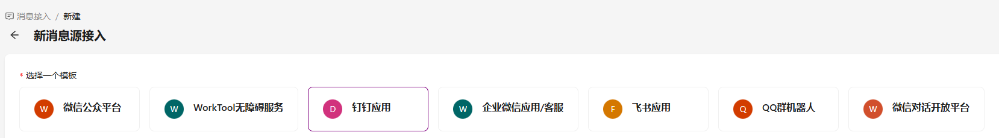
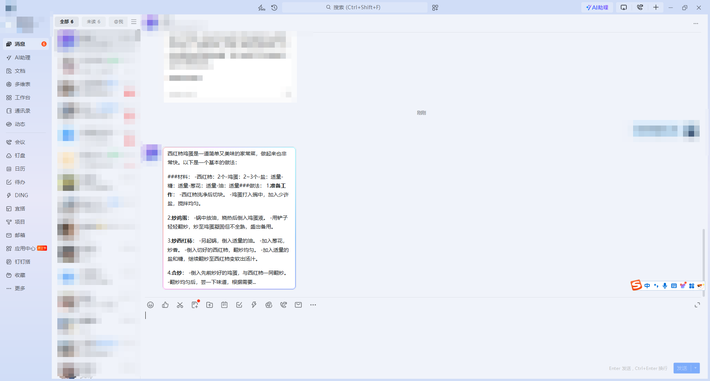
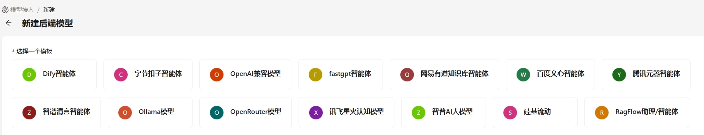
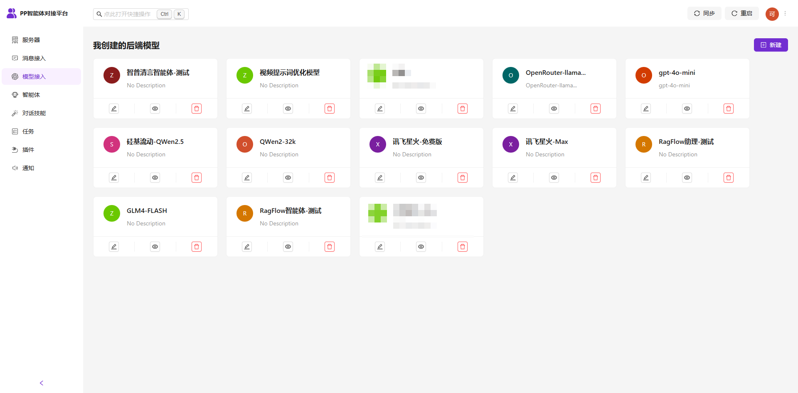
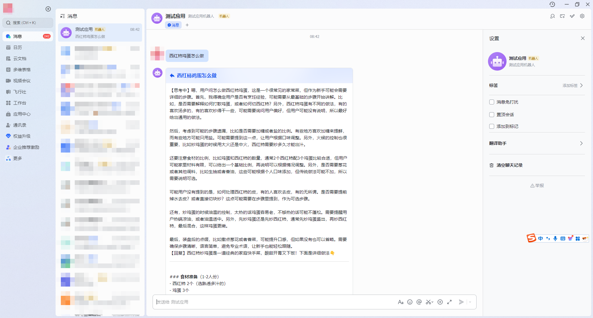

# 即将开源

## 简介

> PPAgent是一个用于连接大模型和消息客户端的中间件，可以用来实现如钉钉、飞书、微信等平台对接大模型、智能体的功能。
> 文档地址：[https://doc.ppagent.cn](http://doc.ppagent.cn)
> 配置页面地址：[https://ppagent.cn](https://ppagent.cn) 第一次打开加载资源较多，请耐心等待。

> [!IMPORTANT]
> 1、是开源项目吗？暂时还不是。一方面目前还没有精力维护开源社区，开源后反而容易导致维护性变差；另一方面框架本身支持插件进行各种功能扩展，并不需要修改源码来实现功能变更。
> 2、可以商用吗？可以自己商用，但是不能作为提供SaaS服务使用。
> 3、收费吗？后端服务是完全免费的，也不存在任何功能限制。前端可视化配置服务也是提供免费使用的。

PPAgent可以作为一个SDK，用于开发后端项目，也支持通过插件的方式对其功能进行扩展，还支持通过可视化的方式进行方便的配置使用。

## 核心概念

### 消息源

> 消息源顾名思义就是消息的来源，如QQ、微信、钉钉、飞书等。本框架内置了常见的消息源，也支持通过插件扩展更多的消息源支持。

#### 消息源特性

- 支持多实例
- 统一消息结构，可二开为消息网关
- 支持图片、文字、声音、文件、地理位置、卡片消息等各种类型
- 钉钉、飞书均支持流式发送

### 后端模型

> 后端模型是用来对用户的消息进行响应的模型，当前主要是指大语言模型或者基于大语言模型的智能体。本框架中内置了众多常见的大模型和智能体后端接口支持。

- 支持多实例
  
- 多模态支持
- OpenAI兼容模型支持
- 支持思考过程

- 统一大模型输出接口，可二开为大模型网关

### 智能体

- 内置历史消息管理
- 消息拆分发送
- 图片提取发送
- 技能叠加，实现语音文字转换、消息总结等各类功能
- 黑白名单，可针对群组、个人分别设置
- 区分思考过程和最终回复
- 设置发送间隔
- 排队发送

### 插件

- 支持在线安装、更新、卸载插件

## 常见场景
- 客服助手。自动回复，对接知识库等，或通过技能的开发实现转人工等操作。
- 企业内部助手。如对接项目管理平台、工单平台等，提供智能化服务
- 个人助手
- 群助理。活跃群气氛
- AI专家团队的消息交互
- 通过开发技能实现聊天记录持久化、自动清洗到知识库
- ...

## 支持的部署方式

> 框架的部署主要指服务端。另外我们提供了线上的前端配置页面，可以对接私有化部署的服务端，提供便捷的配置服务

- [本地化直接部署](https://doc.ppagent.cn/starter/install_code.html)
- [Docker部署](https://doc.ppagent.cn/starter/install_docker.html)
